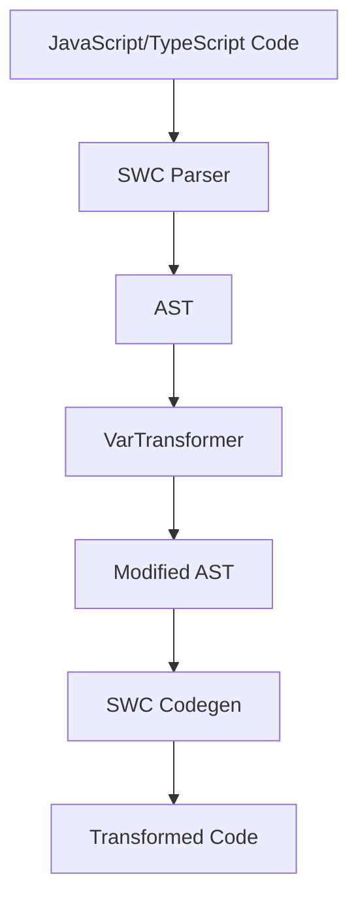

# rsdown

English|[简体中文](./README.md)

[![npm version][npm-version-src]][npm-version-href]
[![npm downloads][npm-downloads-src]][npm-downloads-href]
[![bundle][bundle-src]][bundle-href]
[![JSDocs][jsdocs-src]][jsdocs-href]
[![License][license-src]][license-href]

# rsdown

A high-performance JavaScript/TypeScript code transformer powered by Rust and SWC.

## Features

- 🚀 High performance - Built with Rust and SWC
- 🔄 Transforms `const` and `let` declarations to `var`
- 📦 Easy integration - Works as a Node.js module
- 🛠️ TypeScript support out of the box

## Installation

```bash
npm install rsdown
pnpm add rsdown
yarn add rsdown
bun install rsdown
```
## Usage
```js
import { transformToVar } from 'rsdown'
const code = `const x = 1;let y = 2;`
const result = transformToVar(code)
console.log(result)
// Output:
// var x = 1;
// var y = 2;
```

## API

### `transformToVar(code: string): string`

Transforms JavaScript/TypeScript code by converting `const` and `let` declarations to `var` declarations.

- **Parameters:**
  - `code` (string): The source code to transform
- **Returns:**
  - (string): The transformed code

## Development

### Prerequisites

- [Rust](https://www.rust-lang.org/) (latest stable)
- [Node.js](https://nodejs.org/) (>= 14)
- [pnpm](https://pnpm.io/) (recommended)

### Setup

1. Clone the repository

```bash
git clone https://github.com/Sunny-117/rsdown.git
cd rsdown
```
2. Install dependencies
```bash
pnpm install
```

3. Build the project
```bash
pnpm build
```

4. Run tests

```bash
pnpm test
```

## Technical Details

This project uses:
- [SWC](https://swc.rs/) for JavaScript/TypeScript parsing and transformation
- [napi-rs](https://napi.rs/) for Node.js native module bindings
- [Vitest](https://vitest.dev/) for testing

## Contributing

Contributions are welcome! Please feel free to submit a Pull Request. For major changes, please open an issue first to discuss what you would like to change.

Please make sure to update tests as appropriate.

## License

[MIT](./LICENSE) License © 2024-PRESENT [Sunny-117](https://github.com/Sunny-117)

<!-- Badges -->

[npm-version-src]: https://img.shields.io/npm/v/rsdown?style=flat&colorA=080f12&colorB=1fa669
[npm-version-href]: https://npmjs.com/package/rsdown
[npm-downloads-src]: https://img.shields.io/npm/dm/rsdown?style=flat&colorA=080f12&colorB=1fa669
[npm-downloads-href]: https://npmjs.com/package/rsdown
[bundle-src]: https://img.shields.io/bundlephobia/minzip/rsdown?style=flat&colorA=080f12&colorB=1fa669&label=minzip
[bundle-href]: https://bundlephobia.com/result?p=rsdown
[license-src]: https://img.shields.io/github/license/Sunny-117/rsdown.svg?style=flat&colorA=080f12&colorB=1fa669
[license-href]: https://github.com/Sunny-117/rsdown/blob/main/LICENSE
[jsdocs-src]: https://img.shields.io/badge/jsdocs-reference-080f12?style=flat&colorA=080f12&colorB=1fa669
[jsdocs-href]: https://www.jsdocs.io/package/rsdown

## Architecture Design



## Implementation

rsdown uses Rust and SWC for high-performance code transformation:

1. **Parsing**: Parse source code to AST using SWC parser
2. **Transform**: Modify declaration types using VarTransformer visitor
3. **Generate**: Output result using SWC code generator

For detailed architecture documentation, visit [Architecture Guide](https://sunny-117.github.io/rsdown/en/guide/architecture)
