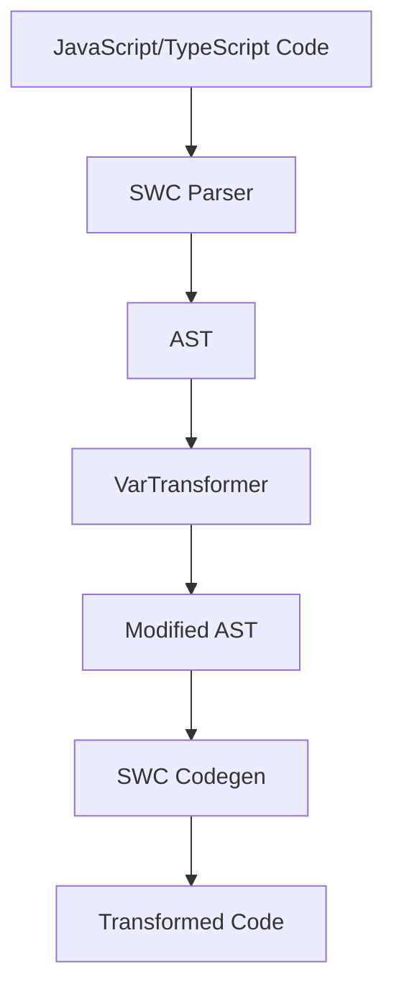

# rsdown

简体中文|[English](./README-en.md)

[![npm 版本][npm-version-src]][npm-version-href]
[![npm 下载量][npm-downloads-src]][npm-downloads-href]
[![包大小][bundle-src]][bundle-href]
[![JSDocs][jsdocs-src]][jsdocs-href]
[![许可证][license-src]][license-href]

# rsdown

一个高性能的 JavaScript/TypeScript 代码转换器，基于 Rust 和 SWC。

## 特性

- 🚀 高性能 - 基于 Rust 和 SWC 构建
- 🔄 转换 `const` 和 `let` 声明为 `var`
- 📦 易于集成 - 作为 Node.js 模块工作
- 🛠️ 开箱即用的 TypeScript 支持

## 安装

```bash
npm install rsdown
pnpm add rsdown
yarn add rsdown
bun install rsdown
```

## 用法

```js
import { transformToVar } from 'rsdown'
const code = `const x = 1;let y = 2;`
const result = transformToVar(code)
console.log(result)
// 输出:
// var x = 1;
// var y = 2;
```

## API

### `transformToVar(code: string): string`

通过将 JavaScript/TypeScript 代码中的 `const` 和 `let` 声明转换为 `var` 声明来进行转换。

- **参数:**
  - `code` (string): 要转换的源代码
- **返回:**
  - (string): 转换后的代码

## 开发

### 先决条件

- [Rust](https://www.rust-lang.org/)（最新稳定版）
- [Node.js](https://nodejs.org/)（>= 14）
- [pnpm](https://pnpm.io/)（推荐）

### 设置

1. 克隆仓库

```bash
git clone https://github.com/Sunny-117/rsdown.git
cd rsdown
```

2. 安装依赖

```bash
pnpm install
```

3. 构建项目

```bash
pnpm build
```

4. 运行测试

```bash
pnpm test
```

## 技术细节

该项目使用：
- [SWC](https://swc.rs/) 进行 JavaScript/TypeScript 的解析和转换
- [napi-rs](https://napi.rs/) 用于 Node.js 原生模块绑定
- [Vitest](https://vitest.dev/) 进行测试

## 贡献

欢迎贡献！请随时提交 Pull Request。对于重大更改，请先打开一个问题以讨论您想要更改的内容。

请确保适当更新测试。

## 许可证

[MIT](./LICENSE) 许可证 © 2024-PRESENT [Sunny-117](https://github.com/Sunny-117)

<!-- 徽章 -->

[npm-version-src]: https://img.shields.io/npm/v/rsdown?style=flat&colorA=080f12&colorB=1fa669
[npm-version-href]: https://npmjs.com/package/rsdown
[npm-downloads-src]: https://img.shields.io/npm/dm/rsdown?style=flat&colorA=080f12&colorB=1fa669
[npm-downloads-href]: https://npmjs.com/package/rsdown
[bundle-src]: https://img.shields.io/bundlephobia/minzip/rsdown?style=flat&colorA=080f12&colorB=1fa669&label=minzip
[bundle-href]: https://bundlephobia.com/result?p=rsdown
[license-src]: https://img.shields.io/github/license/Sunny-117/rsdown.svg?style=flat&colorA=080f12&colorB=1fa669
[license-href]: https://github.com/Sunny-117/rsdown/blob/main/LICENSE
[jsdocs-src]: https://img.shields.io/badge/jsdocs-reference-080f12?style=flat&colorA=080f12&colorB=1fa669
[jsdocs-href]: https://www.jsdocs.io/package/rsdown

## 架构设计



## 实现原理

rsdown 使用 Rust 和 SWC 实现高性能的代码转换：

1. **解析**: 使用 SWC 的解析器将源代码解析为 AST
2. **转换**: 通过 VarTransformer 访问器修改声明类型
3. **生成**: 使用 SWC 的代码生成器输出结果

详细的架构说明请查看 [架构文档](https://sunny-117.github.io/rsdown/guide/architecture)
