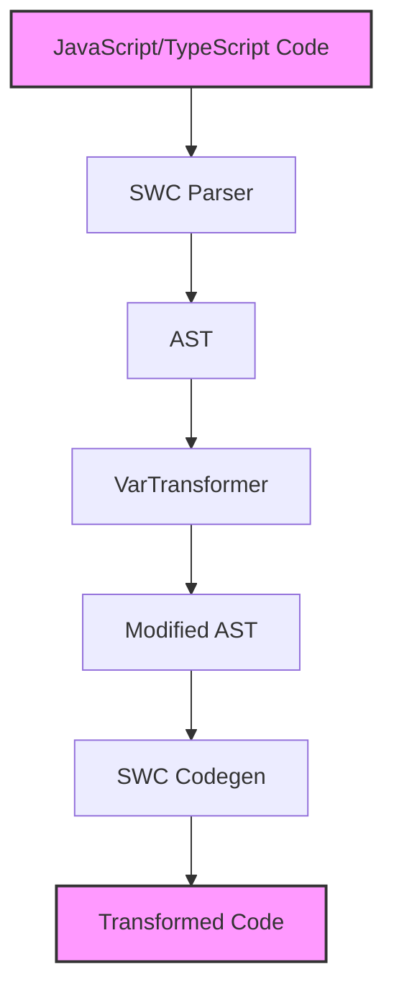
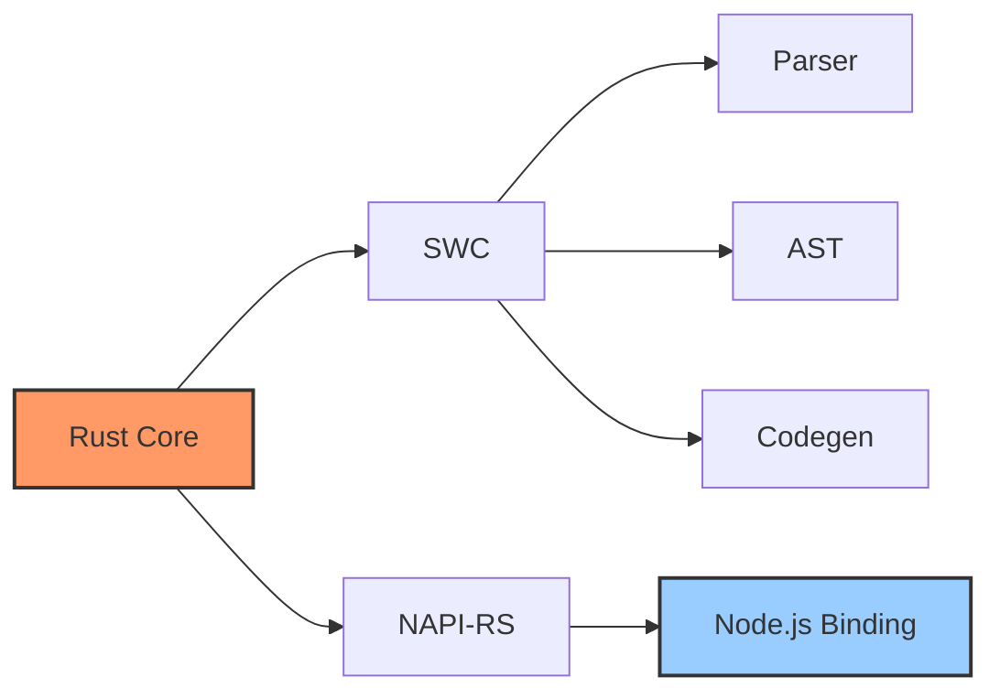

# Architecture Design

## Overall Architecture



## Core Process

1. **Code Parsing**
   - Convert source code to token stream using SWC's lexer
   - Build AST from token stream using parser

2. **AST Transformation**
   - Implement `VarTransformer` visitor
   - Traverse AST to locate `const` and `let` declarations
   - Modify declaration types to `var`

3. **Code Generation**
   - Use SWC's code generator
   - Convert modified AST back to source code

## Tech Stack



## Code Structure

```
rsdown/
├── src/
│   ├── lib.rs      # Core transformation logic
│   └── debug.rs    # Debug utilities
├── test/
│   └── index.test.ts   # Test cases
└── docs/
    └── .vitepress/     # Documentation config
```

## Implementation Details

### 1. Lexical and Syntax Analysis

```rust
// Create lexer
let lexer = Lexer::new(
    Syntax::Es(Default::default()),
    Default::default(),
    StringInput::from(&*fm),
    None,
);

// Create parser and parse
let mut parser = Parser::new_from(lexer);
let mut module = parser.parse_module().unwrap();
```

### 2. AST Transformation

```rust
impl VisitMut for VarTransformer {
    fn visit_mut_var_decl(&mut self, var_decl: &mut VarDecl) {
        // Transform const and let to var
        var_decl.kind = VarDeclKind::Var;
    }
}
```

### 3. Code Generation

```rust
let mut buf = vec![];
let writer = JsWriter::new(cm.clone(), "\n", &mut buf, None);
let mut emitter = Emitter {
    cfg: swc_ecma_codegen::Config::default(),
    cm: cm.clone(),
    comments: None,
    wr: writer,
};

emitter.emit_module(&module).unwrap();
```
