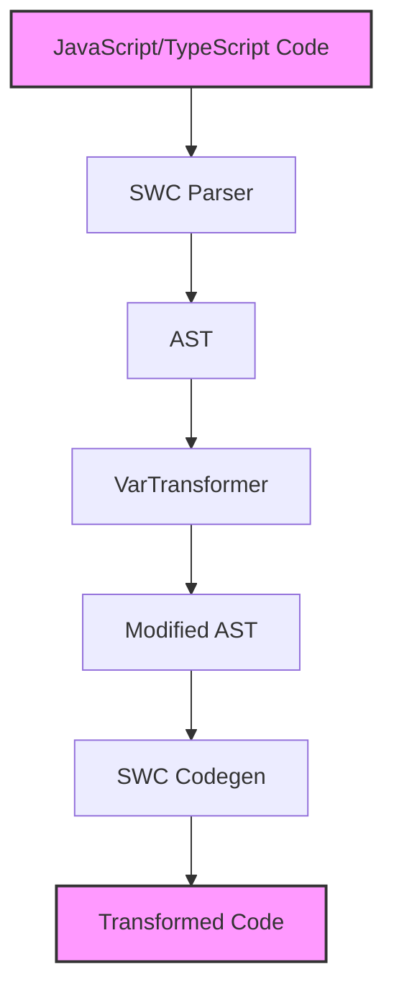
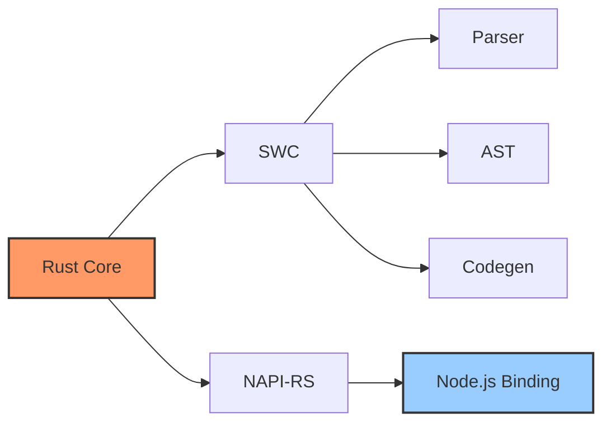

# 架构设计

## 整体架构



## 核心流程

1. **代码解析 (Parser)**
   - 使用 SWC 的词法分析器将源代码转换为 token 流
   - 通过语法分析器将 token 流构建为 AST

2. **AST 转换 (Transform)**
   - 实现 `VarTransformer` 访问器
   - 遍历 AST，定位 `const` 和 `let` 声明
   - 将声明类型修改为 `var`

3. **代码生成 (Codegen)**
   - 使用 SWC 的代码生成器
   - 将修改后的 AST 转换回源代码

## 技术栈



## 代码结构

```
rsdown/
├── src/
│   ├── lib.rs      # 核心转换逻辑
│   └── debug.rs    # 调试辅助
├── test/
│   └── index.test.ts   # 测试用例
└── docs/
    └── .vitepress/     # 文档配置
```

## 实现细节

### 1. 词法分析和语法分析

```rust
// 创建词法分析器
let lexer = Lexer::new(
    Syntax::Es(Default::default()),
    Default::default(),
    StringInput::from(&*fm),
    None,
);

// 创建语法分析器并解析
let mut parser = Parser::new_from(lexer);
let mut module = parser.parse_module().unwrap();
```

### 2. AST 转换

```rust
impl VisitMut for VarTransformer {
    fn visit_mut_var_decl(&mut self, var_decl: &mut VarDecl) {
        // 将 const 和 let 转换为 var
        var_decl.kind = VarDeclKind::Var;
    }
}
```

### 3. 代码生成

```rust
let mut buf = vec![];
let writer = JsWriter::new(cm.clone(), "\n", &mut buf, None);
let mut emitter = Emitter {
    cfg: swc_ecma_codegen::Config::default(),
    cm: cm.clone(),
    comments: None,
    wr: writer,
};

emitter.emit_module(&module).unwrap();
```
